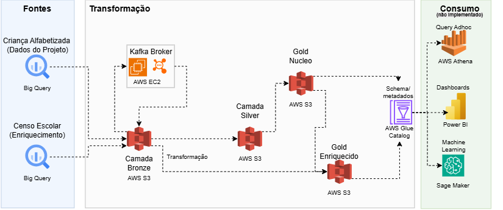

# Tech Challenge Fase 2 - Engenharia de Dados

Pipeline de dados híbrido (batch + streaming), seguindo Arquitetura Medalhão (Bronze → Silver → Gold), construído em AWS, para análise do **Indicador Criança Alfabetizada** e apoio ao Compromisso Nacional Criança Alfabetizada.

---
## Apresentação

- 🎥 **Vídeo executivo (5 min):** https://drive.google.com/drive/folders/10c53VD9qFSMmXbRNJGLdUY5e8-OflF8q?usp=sharing

- 📊 **Slides:** [`pipeline/docs/apresentacao/apresentacao-tech-challenge.pptx`](pipeline/docs/apresentacao/apresentacao-tech-challenge.pptx)

---

## O problema

O governo brasileiro tem a meta de que todas as crianças estejam alfabetizadas até o fim do 2º ano do Ensino Fundamental, até **2030** (Compromisso Nacional Criança Alfabetizada). O indicador oficial usa um ponto de corte de proficiência do SAEB (743 pontos).

Avaliar isso de verdade exige cruzar várias fontes — metas nacionais/estaduais/municipais, dados territoriais, microdados por aluno, e opcionalmente indicadores de infraestrutura escolar — todas publicadas na plataforma **Base dos Dados** (datalake público sobre BigQuery).

Este projeto simula o trabalho de um time de engenharia de dados construindo a infraestrutura que torna essa análise possível: da extração bruta até datasets prontos para consumo, com governança, qualidade e controle de custo.

---

## Arquitetura



> Diagrama com ícones AWS/GCP: `pipeline/docs/imagens/pipeline/docs/imagens/diagrama-arquitetura-app-diagrams.png`

| Camada | O que acontece | Onde processa |
|---|---|---|
| Bronze | Extração fiel da fonte, sem transformação | Script Python, execução local |
| Silver | Tradução de códigos, enriquecimento geográfico, agregações | Script Python, execução local |
| Gold núcleo | 3 datasets analíticos, com validação fail-fast | Script Python, execução local |
| Gold enriquecida | Núcleo unido à infraestrutura escolar | Script Python, execução local |
| Streaming | Kafka, hospedado em EC2 | Nuvem, contínuo |

O processamento de transformação roda localmente durante o desenvolvimento — não é a opção definitiva para produção, é uma decisão de tempo e escopo, explicada na seção de trade-offs.

### Infraestrutura AWS, em detalhe

**S3** — um único bucket (`pos-tech-fiap-985034838182-us-east-1-an`), organizado por camada e origem: `bronze/<dataset>/<tabela>/ano=<ano>/`, `silver/<tabela>/ano=<ano>/`, `gold/<tabela>/ano=<ano>/`. Todos os arquivos em Parquet, particionados por `ano` — formato colunar comprimido, e o particionamento existe especificamente para o Athena escanear só o necessário em cada query, reduzindo custo.

**Glue Data Catalog** — dois databases: `alfabetizacao_silver` e `alfabetizacao_gold`, cada um populado por um Crawler próprio, apontando para o prefixo S3 correspondente. O Crawler infere schema e partições automaticamente a partir da estrutura de pastas.

**Athena** — consulta SQL serverless sobre os dados catalogados, usando o workgroup padrão (`primary`). Sem cluster provisionado; o custo é por volume de dado escaneado em cada query.

**EC2 (Kafka)** — uma instância `t2.micro` (free tier), com Security Group restringindo as portas 22 (SSH) e 9092 (Kafka) ao IP de quem está desenvolvendo. Kafka e Zookeeper rodam em containers Docker nessa instância, definidos em `pipeline/streaming/docker-compose.yml`.

**IAM** — um usuário com política customizada (least privilege) e uma Role separada (`GlueCrawlerServiceRole`) para o Glue Crawler assumir. Detalhes na seção de decisões, item 5.

### Organização do código

Os scripts de ingestão, transformação e construção da Gold seguem o mesmo padrão: ler do S3, transformar com pandas, salvar e subir de volta. Boa parte dessa lógica (baixar um Parquet do S3, listar arquivos de um prefixo, concatenar partições) se repetia em quase todo script — motivo pelo qual foi criado `pipeline/scripts/utils.py`, centralizando essas funções auxiliares para os scripts mais recentes (construção da Gold) importarem em vez de duplicar. Essa centralização não foi aplicada retroativamente aos scripts mais antigos de Bronze e Silver — ver seção de limitações.

---

## Tecnologias e por quê

| Camada | Tecnologia | Justificativa |
|---|---|---|
| Cloud | **AWS** (100%) | Familiaridade prévia com a plataforma; free tier cobre integralmente o escopo do projeto |
| Extração | `basedosdados` (Python) sobre **BigQuery público** | Única forma de acesso à Base dos Dados — não é API REST, é um datalake público hospedado no BigQuery |
| Armazenamento | **S3**, Parquet particionado por ano | Ver detalhamento acima |
| Catálogo | **Glue Data Catalog** + Crawler | Descoberta automática de schema, free tier generoso |
| Consulta | **Athena** | Serverless, paga por TB escaneado, sem cluster ocioso |
| Streaming | **Kafka** (Docker) em **EC2** | Kafka de fato, hospedado na nuvem — decisão corrigida no meio do projeto, ver seção 2 |
| Qualidade | Framework Python próprio | Ver seção de Qualidade de Dados |
| Governança | IAM least privilege | Ver seção de decisões, item 5 |

---

## Decisões Arquiteturais e Trade-offs

Esta seção não é uma lista de arquitetura definida de antemão — várias dessas decisões mudaram no meio do caminho, algumas depois de um erro identificado em produção. O processo de correção fica registrado, não só a decisão final.

### 1. Batch vs. Streaming

O pipeline implementa os dois modos lado a lado. **Batch:** extração completa das 10 tabelas, particionada por ano — coerente com o fato de avaliações educacionais serem publicadas periodicamente, não continuamente. **Streaming (simulado):** a Base dos Dados não emite eventos em tempo real, então uma amostra de 300 registros da tabela `alunos` (já ingerida em batch) é reproduzida via Kafka, publicada com um pequeno delay entre mensagens — simulando resultados chegando aos poucos.

**Decisão de fonte do streaming:** o producer lê da camada **Bronze**, não da Silver. A justificativa: a aplicação que gera um evento não deveria saber nada sobre tradução de código ou enriquecimento geográfico — isso é responsabilidade da camada de transformação, não da origem do dado.

### 2. Kafka: a decisão que foi revertida

**Primeira tentativa:** subir o Kafka localmente, via Docker, no notebook de desenvolvimento.

**Por que foi revertida:** o enunciado exige "Implementação em Cloud". Rodar o broker localmente significa que a peça central do streaming nunca toca a AWS — diferente de scripts como producer/consumer, que são só clientes conversando com um serviço, o broker *é* o serviço.

**Alternativas avaliadas:**

| Opção | Por que não |
|---|---|
| Amazon MSK | Sem free tier — cobra por broker-hora mesmo sem uso |
| Amazon Kinesis | Sem free tier real, e trocaria Kafka por um serviço proprietário |
| **EC2 + Docker (opção adotada)** | Kafka de fato, dentro do free tier, sem abrir mão de nada |

**Três problemas de infraestrutura enfrentados na migração**, um escondido atrás do outro:

1. **Security Group bloqueando** — o IP doméstico mudou entre sessões de trabalho, e a regra da porta 9092 ficou presa no IP antigo. Resolvido comparando o IP atual com a regra a cada sessão.
2. **Kafka encerrando sozinho ao iniciar** — o container aparecia "Up" por segundos e depois caía. O log revelou `Native memory allocation (mmap) failed to map 1073741824 bytes`: a imagem padrão do Confluent reserva 1GB de heap sozinha, mas a `t2.micro` só tem 1GB de RAM no total. Corrigido limitando `KAFKA_HEAP_OPTS` a 400MB.
3. **`advertised.listeners` com `0.0.0.0`** — mesmo com a memória resolvida, producer e consumer externos não conseguiam conectar. O erro do próprio Kafka: `cannot use the nonroutable meta-address 0.0.0.0`. Corrigido trocando pelo IP público da instância.

### 3. Construindo a Gold: Python ou Athena CTAS?

Decisão: **Python (pandas)**, mantendo o mesmo padrão de Bronze e Silver.

| Critério | Python | Athena CTAS |
|---|---|---|
| Consistência com o resto do pipeline | Mesmo padrão do início ao fim | Introduziria SQL isolado |
| Reshape wide→long (`metas_vs_resultados`) | `pd.melt()` — uma linha | Exigiria `UNION ALL` manual (sem `UNPIVOT` nativo) |
| Orquestração futura (Step Functions/Airflow) | Precisaria de compute host atrás | Vantagem do CTAS: chama a API do Athena direto, sem máquina rodando |

A vantagem do CTAS para orquestração automática foi reconhecida e documentada como caminho de evolução — não implementada por escolha de escopo.

### 4. Data Lake, não Data Warehouse

S3 + Glue + Athena em vez de Redshift provisionado. Com cerca de 150MB de dados e consulta esporádica, um cluster sempre ligado representaria custo sem retorno proporcional. Athena cobra só pelo que é consultado.

### 5. Governança de acesso (IAM)

Modelo de **least privilege** desde o início: um IAM User (política customizada) para o trabalho de desenvolvimento, e uma IAM Role separada (`GlueCrawlerServiceRole`) só para o Glue usar — nunca a mesma identidade para pessoa e serviço. A permissão `iam:PassRole` do usuário é restrita a essa Role específica, com `Condition` exigindo destino `glue.amazonaws.com`.

**Um padrão que se repetiu ao longo do projeto:** a AWS frequentemente separa "ver que algo existe" de "usar aquilo" — foi necessário adicionar `iam:ListRoles`, `glue:ListCrawlers`, `ec2:DescribeSecurityGroupRules` em momentos diferentes, cada vez que o console reclamava de "Access Denied" numa tela que só *listava* algo, não executava nada.

**Um incidente de segurança tratado com prioridade:** durante uma sessão de debug, uma Access Key apareceu em texto claro no output de um comando. A credencial foi rotacionada imediatamente — desativada e substituída — independentemente de avaliar se alguém teria visto de fato.

### 6. O código de `rede` que a exploração revelou

Ao montar as tabelas Gold, o código `"0"` (Total: Federal+Estadual+Municipal+Privada) foi escolhido inicialmente como o agregado pronto. Ao construir `evolucao_temporal`, notou-se que só havia dado de um ano.

A investigação contou linhas por código de rede:
```
UF:         rede=0 → 0 linhas (2023), 1 linha (2024)
Município:  rede=0 → 0 linhas (2023), 398 linhas (2024)
```

O código `"0"` estava praticamente vazio nos dois anos. O código `"5"` (Pública: Estadual+Municipal) tinha cobertura muito melhor (24-25 UFs, 4.950-5.516 municípios) — e faz mais sentido de domínio, já que a política pública em questão é sobre a rede pública de ensino. As tabelas Gold passaram a usar `rede="5"`.

### 7. O bug encontrado ao desenhar o diagrama de arquitetura

Ao testar uma query no Athena (`SELECT * FROM indicador_por_municipio`) para confirmar que o diagrama de arquitetura correspondia à implementação, o retorno foi:
```
HIVE_INVALID_METADATA: Table descriptor contains duplicate columns
```

Causa: a coluna `ano`, usada para particionar os arquivos no S3, também estava salva dentro de cada arquivo Parquet. O Glue Crawler detectava duas colunas `ano` — uma do arquivo (`bigint`), outra do caminho da pasta (`string`) — e o Athena recusa essa ambiguidade. Corrigido removendo a coluna de particionamento do conteúdo do arquivo antes de salvar. O problema só apareceu porque o fluxo foi testado de ponta a ponta, não apenas assumido como correto por ter rodado sem erro.

### 8. Custo vs. Performance

Ver seção de FinOps abaixo — inclui um gasto inesperado identificado, investigado e corrigido durante o desenvolvimento.

---

## Qualidade de Dados

### A estratégia por camada

| Camada | Estratégia | Por quê |
|---|---|---|
| Bronze | Reportar (log de warning) | Dado bruto — variabilidade esperada, bloquear travaria o pipeline por algo que pode nem ser um problema |
| Silver | Reportar (log de warning) | Dado intermediário — um problema aqui pede investigação, não interrupção automática |
| **Gold** | **Fail-fast** (interrompe o pipeline) | Última barreira antes de alguém confiar nesse dado como verdade |

O padrão de "quarentena" (separar registros válidos/inválidos sem travar) foi avaliado e descartado — para o volume e tipo de inconsistência já confirmado na exploração de dados, o custo de implementar essa separação não se justificava.

### O framework

Classe própria (`DataQualityCheck`, em `pipeline/scripts/data_quality.py`), inspirada num padrão observado em material de referência do curso, mas escrita do zero, com apenas os 4 tipos de checagem utilizados:

```python
DataQualityCheck(df, "gold.indicador_por_municipio") \
    .check_duplicidade(["ano", "id_municipio"]) \
    .check_range("taxa_alfabetizacao", 0, 100) \
    .logar(logger) \
    .falhar_se_critico()
```

| Dimensão | O que verifica | Aplicado a |
|---|---|---|
| Uniqueness | Duplicidade em chave composta | `(ano, id_municipio, rede, serie)` — validada como única ainda na exploração |
| Completeness | Nulos, condicionalmente | `proporcao_aluno_nivel_*`: nulo só é esperado se `ano=2023` (metodologia mudou em 2024) |
| Validity | Integridade referencial | Referências geográficas existem no diretório de UF/Município |
| Consistency | Faixa de valor plausível | Percentuais entre 0 e 100 |

### Onde a estratégia se provou útil

A validação fail-fast identificou um problema de duplicidade causado por falta de idempotência (scripts re-executados em dias diferentes gerando arquivo novo sem apagar o anterior). Ao rodar `build_gold_enriquecida.py` sobre um caso assim:

```
[DQ:gold.indicador_x_infraestrutura_escolar] FAIL | Uniqueness | duplicidade | ano,id_municipio | 398 linhas duplicadas
Exception: [DQ:...] 1 check(s) falharam - pipeline interrompido (estrategia fail-fast na Gold).
```

O pipeline parou sozinho, antes do dado duplicado chegar à Gold — evidência de que o mecanismo funciona na prática, não apenas em documentação.

---

## FinOps e Monitoramento

*(Detalhamento completo, com prints do Cost Explorer e do Budget, em `pipeline/docs/FINOPS.md`)*

### O que foi identificado

Via AWS Cost Explorer: **$4,06** acumulados no mês, concentrados em EC2 Compute ($2,66) e VPC ($1,15) — valor acima da expectativa de "custo perto de zero dentro do free tier". Um AWS Budget configurado manualmente já havia sinalizado o gasto de forma automática ("1 over budget", "1 cost anomaly detected") antes mesmo da investigação começar.

### A investigação (Informar → Otimizar → Operar)

1. **Informar:** Cost Explorer e Budget revelaram o gasto e a categoria de serviço
2. **Otimizar:** hipóteses descartadas uma a uma — NAT Gateway? Não encontrado. Elastic IP ocioso? Não encontrado. Instância EC2 rodando continuamente entre sessões de trabalho não consecutivas? Confirmado. A instância foi parada manualmente.
3. **Operar (não implementado):** automação de desligamento por inatividade via CloudWatch Alarm + Lambda, ou EventBridge Scheduler — documentado como próximo passo, não implementado por restrição de tempo.

### Decisões que já reduzem custo

- Parquet particionado por ano (menos bytes escaneados no Athena)
- Athena serverless em vez de Redshift provisionado
- EC2 sob demanda (liga/desliga) em vez de MSK (custo fixo)
- IAM least privilege (reduz risco de recurso órfão gerando custo não identificado)

### Monitoramento do pipeline

Em múltiplas camadas: logging estruturado em todos os scripts; validação fail-fast na Gold (funciona como alerta ativo — ver seção anterior); e um script próprio, `monitoramento_pipeline.py`, que gera um relatório de saúde (volume, contagem de arquivos, última execução por camada), sinalizando "ATENÇÃO" para camadas desatualizadas.

Alertas em tempo real via CloudWatch Alarms customizados foram avaliados e não implementados (item opcional do desafio) — o Budget nativo já cobre parte dessa necessidade sem esforço adicional.

---

## Aplicação de Inteligência Artificial

Nenhum modelo foi treinado neste projeto — o escopo aqui é engenharia de dados, não modelagem preditiva. Vale registrar por que a camada Gold deixa esse próximo passo mais acessível do que partindo do dado bruto: a maior parte do trabalho de um projeto de ciência de dados não é treinar o modelo, é chegar num dataset limpo e cruzado — que é o que Silver e Gold entregam.

**Prever municípios em risco de não atingir a meta de 2030** — um modelo de classificação usando infraestrutura escolar e histórico de `evolucao_temporal` como entrada, tentando antecipar trajetórias de risco antes do resultado aparecer.

**Agrupar municípios por padrão de desempenho e infraestrutura** — clustering sobre `metas_vs_resultados` cruzado com geografia, para revelar desigualdade regional que uma média nacional esconde.

**Relacionar tipo de investimento a variação de resultado** — como a Gold já calcula `variacao_pp`, um modelo de regressão poderia estimar qual investimento parece mais associado a melhora — não é causalidade comprovada, mas é mais informado que decisão baseada só em histórico.

Nenhuma dessas três direções foi testada ou validada estatisticamente. São hipóteses plausíveis dado o que os dados permitem, não promessas de resultado — o que este projeto entrega é o trabalho de engenharia que deixaria qualquer uma delas pronta para começar.

---

## Limitações Conhecidas

Cada item abaixo foi identificado durante o desenvolvimento e deixado de fora conscientemente, geralmente por restrição de tempo — não por desconhecimento.

| Limitação | Como foi identificada | Por que não foi corrigida ainda |
|---|---|---|
| **Idempotência parcial** — scripts re-executados em dias diferentes podem duplicar dados | Pela validação fail-fast (ver Qualidade de Dados) | Corrigida em `build_gold.py`/`build_gold_enriquecida.py`; ainda pendente em `ingest_bronze.py`/`transform_silver.py` |
| Processamento local, não em serviço gerenciado | Decisão consciente desde o início | Migrar para Glue Python Shell Job é o próximo passo natural, não implementado por escopo |
| Sem Elastic IP na EC2 do Kafka | O IP mudava a cada reinício, exigindo reconfiguração manual | Elastic IP tem custo se não associado a instância ativa; evitado após o episódio de FinOps |
| Sem volume Docker persistente para o Kafka | Identificado por inspeção, nunca testado sob falha | O container nunca precisou ser recriado do zero durante o projeto |
| Premissa temporal no enriquecimento — infraestrutura de 2024 aplicada também a 2023 | Percebida ao comparar a cobertura temporal das duas fontes | Preserva mais dado útil que excluir 2023; documentada como premissa, não como dado observado |
| Sem desligamento automático por inatividade | Essa ausência gerou o custo de $3,86 relatado em FinOps | Corrigida manualmente; automação via CloudWatch/EventBridge documentada como próximo passo |

---

## Como Reproduzir

### Pré-requisitos
Conta AWS (free tier), conta GCP (sandbox), Python 3.11+, Docker, Git.

### Setup

```powershell
git clone https://github.com/wesleycsousa/ai-scentist-tech-challenge-2-data-engineering.git
cd ai-scentist-tech-challenge-2-data-engineering
python -m venv venv
venv\Scripts\Activate.ps1
pip install -r requirements.txt
```

Configura o `.env` (não versionado) com credenciais AWS, `S3_BUCKET`, `BILLING_PROJECT_ID` (GCP), `KAFKA_BOOTSTRAP_SERVERS`.

Infraestrutura EC2/Kafka: siga `pipeline/streaming/SETUP-EC2.md`.

### Execução, em ordem

```powershell
python pipeline\scripts\ingest_bronze.py
python pipeline\scripts\transform_silver.py
python pipeline\scripts\stream_producer.py      # requer Kafka rodando na EC2
python pipeline\scripts\stream_consumer.py
python pipeline\scripts\ingest_bronze_enriquecimento.py
python pipeline\scripts\transform_silver_enriquecimento.py
python pipeline\scripts\build_gold.py
python pipeline\scripts\build_gold_enriquecida.py
python pipeline\scripts\monitoramento_pipeline.py
```

---

## Estrutura do Repositório

## Estrutura do Repositório

```
pipeline/
├── scripts/
│   ├── ingest_bronze.py                    # ingestão Bronze (dataset principal)
│   ├── ingest_bronze_enriquecimento.py      # ingestão Bronze (Censo Escolar)
│   ├── transform_silver.py                  # transformação Silver (dataset principal)
│   ├── transform_silver_enriquecimento.py    # transformação Silver (enriquecimento)
│   ├── build_gold.py                        # construção da Gold núcleo
│   ├── build_gold_enriquecida.py             # construção da Gold enriquecida
│   ├── stream_producer.py                    # producer Kafka (streaming simulado)
│   ├── stream_consumer.py                    # consumer Kafka
│   ├── data_quality.py                       # framework de qualidade (DataQualityCheck)
│   ├── utils.py                              # funções compartilhadas (S3, idempotência)
│   └── monitoramento_pipeline.py              # relatório de saúde do pipeline
├── streaming/
│   ├── docker-compose.yml                    # Kafka + Zookeeper
│   └── SETUP-EC2.md                          # setup da instância + troubleshooting
├── docs/
│   ├── FINOPS.md                              # custo, causa raiz, evidências
│   ├── monitoramento_*.csv                    # relatórios gerados
│   └── imagens/                               # diagrama de arquitetura, prints AWS
│   └── apresentacao/                          # material do video de apresentacao
|
├── bronze/ silver/ gold/                       # pastas organizacionais (dados no S3)
└── data/tmp/                                  # rascunho local, não versionado

.env                # credenciais e configuração — não versionado
requirements.txt    # dependências Python
```

**Git:** `main` ← `develop` ← `feature/*`, com Pull Requests documentando cada decisão e trade-off — histórico completo no repositório.
