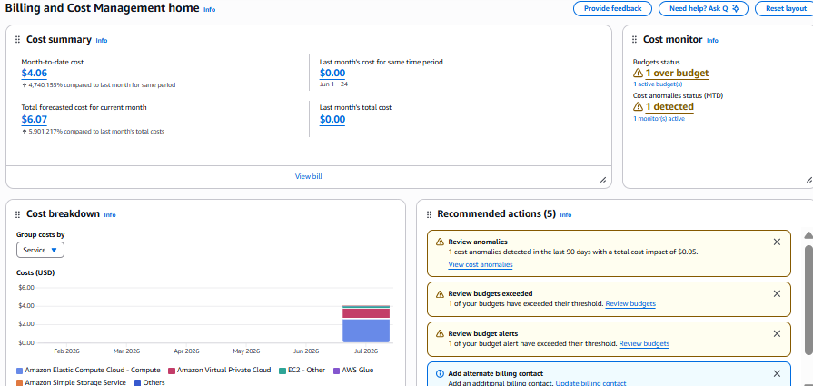
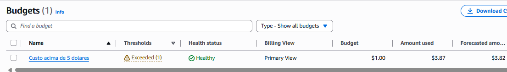

# FinOps — Relatório de Custos e Otimização

## Resumo Executivo

Durante o desenvolvimento do pipeline, o custo real da infraestrutura foi
monitorado via AWS Cost Explorer e AWS Budgets. Identificamos um custo
acumulado de **$4,06** no mês corrente (Julho/2026, 24 dias decorridos),
com projeção (forecast) de **$6,07** para o mês completo — concentrado
majoritariamente em EC2 Compute e componentes de rede (VPC). A causa raiz
foi identificada e corrigida durante o próprio desenvolvimento, e o sistema
de Budget/Anomaly Detection da AWS **já sinalizou o problema automaticamente**
("1 over budget", "1 cost anomaly detected") — evidência de que o
monitoramento de custo funcionou na prática, não só em teoria.

---

## 1. Volume de Dados Processados

Levantado via `pipeline/scripts/monitoramento_pipeline.py`, em 24/07/2026:

| Camada | Arquivos | Tamanho |
|---|---|---|
| Bronze (principal) | 10 | 63,64 MB |
| Bronze (diretórios) | 2 | 0,49 MB |
| Bronze (enriquecimento) | 1 | 2,14 MB |
| Bronze (streaming) | 1 | 0,01 MB |
| Silver | 15 | 78,66 MB |
| Gold (núcleo + enriquecida) | 9 | 1,70 MB |
| **Total** | **38** | **~146,6 MB** |

Volume equivalente a **2,9% do S3 Free Tier** (5 GB/12 meses) — folga
considerável para o escopo do projeto.

---

## 2. Custo Real por Serviço (AWS Cost Explorer)

Custo acumulado no mês (Julho/2026, month-to-date):

| Serviço | Custo (MTD) |
|---|---|
| EC2 - Instances | $2,66 |
| Amazon VPC | $1,15 |
| EC2 - Other (EBS, transferência) | $0,19 |
| AWS Glue | $0,05 |
| Amazon S3 | $0,00 |
| Amazon CloudWatch | $0,00 |
| **Total** | **$4,06** |

Comparado a Junho/2026 (mês anterior, sem uso ativo do projeto): custo de
**$0,00**, confirmando que 100% do gasto está associado à atividade deste
projeto especificamente.

**Forecast da AWS para o mês completo:** $6,07 — projeção baseada no ritmo
de gasto observado nos primeiros 24 dias.

---

## 3. Investigação da Causa Raiz

Metodologia aplicada — descarte sistemático de hipóteses antes de agir:

| Hipótese verificada | Resultado |
|---|---|
| NAT Gateway ativo (custo ~$0,045/h) | ❌ Descartado — nenhum NAT Gateway encontrado |
| Elastic IP alocado sem instância associada | ❌ Descartado — nenhum IP "solto" encontrado |
| Instância EC2 em execução contínua | ✅ **Confirmado** — instância do Kafka (`t2.micro`) permaneceu `running` entre múltiplas sessões de trabalho não consecutivas, ultrapassando o uso eficiente do horário do free tier (750h/mês) |

**Causa raiz:** a instância EC2 hospedando o Kafka não foi parada manualmente
entre sessões de desenvolvimento, acumulando horas de execução sem uso ativo.
O custo de VPC ($1,15) é atribuído a componentes de rede associados ao
tráfego e à própria existência da instância em execução prolongada, não a
um recurso de rede isolado mal configurado.

---

## 4. Ação Corretiva Aplicada

- Instância EC2 do Kafka parada manualmente (`Instance State → Stop`) fora dos
  períodos de desenvolvimento ativo
- Evidência (prints do Cost Explorer, telas de investigação) preservada antes
  da correção, para documentação do processo em README/vídeo executivo

---

## 5. Decisões Arquiteturais que Já Reduzem Custo

| Decisão | Economia gerada |
|---|---|
| Parquet (colunar, compactado) em vez de CSV | Menor volume de storage e de bytes escaneados pelo Athena |
| Particionamento por `ano` em todas as camadas | Athena escaneia só as partições necessárias por query, não a tabela inteira |
| Athena (serverless) em vez de Redshift provisionado | Paga por TB escaneado, sem custo fixo de cluster ocioso |
| Glue Data Catalog + Crawler em vez de DDL manual recorrente | Free tier generoso (1M objetos/requisições grátis) |
| Kafka em EC2 `t2.micro` (free tier) em vez de Amazon MSK | MSK tem custo mínimo fixo por broker-hora, mesmo sem uso; EC2 sob demanda permite ligar/desligar |
| IAM least privilege (sem recursos criados por acidente/permissão excessiva) | Reduz risco de recursos órfãos gerando custo não identificado |

---

## 6. Ciclo FinOps Aplicado (Informar → Otimizar → Operar)

1. **Informar:** monitoramento via AWS Cost Explorer e AWS Budgets revelou
   aumento de $0 para $4,06 no mês, com detalhamento por serviço; o próprio
   Cost Anomaly Detection da AWS sinalizou automaticamente ("1 cost anomaly
   detected", impacto de $0,05) e o Budget configurado disparou o alerta
   "1 over budget"
2. **Otimizar:** investigação estruturada identificou a causa raiz (instância
   EC2 ociosa) e ação corretiva imediata (parar a instância)
3. **Operar (próximo passo, não implementado neste projeto):** automação de
   desligamento por inatividade via CloudWatch Alarm (métrica `CPUUtilization`)
   acionando uma função Lambda, ou agendamento fixo via EventBridge Scheduler
   (ex.: desligar automaticamente às 23h). Não implementado por restrição de
   tempo/escopo — documentado como evolução natural para maturidade
   operacional em um cenário de produção

---

## 7. Monitoramento do Pipeline

Complementar ao controle de custo, o pipeline é monitorado em múltiplas
camadas:

1. **Logging estruturado** em todos os scripts (volume processado, sucesso/erro por etapa)
2. **Validação de qualidade fail-fast na Gold** — funciona como alerta ativo, interrompendo o pipeline antes de dados inconsistentes chegarem à camada de consumo. Validado na prática: identificou um bug real de duplicidade (falta de idempotência) durante o desenvolvimento
3. **Relatório de saúde consolidado** (`monitoramento_pipeline.py`) — volume, contagem de arquivos e data da última execução por camada, sinalizando "ATENÇÃO" para camadas sem atualização recente

Alertas em tempo real via CloudWatch Alarms customizados foram avaliados e
não implementados (item opcional do desafio) — mesma lógica de priorização
de escopo aplicada em outras decisões do projeto. O alerta de Budget nativo
(Seção 9) cobre parcialmente essa necessidade sem esforço de implementação
adicional.

---

## 8. Estimativa de Custo Projetado (cenário de produção)

Referência de custo caso os componentes saíssem do free tier, mantendo o
mesmo volume/arquitetura:

| Serviço | Custo estimado fora do free tier |
|---|---|
| EC2 `t2.micro` (Kafka, 24/7) | ~$8,47/mês |
| S3 (146,6 MB) | ~$0,003/mês (irrisório) |
| Athena (consultas sobre ~150MB) | Frações de centavo por query |
| Glue Crawler (execuções pontuais) | ~$0,10–0,20 por execução |

Reforça a decisão por EC2 sob demanda (ligar apenas durante uso ativo) em vez
de um serviço always-on gerenciado como Amazon MSK.

---

## 9. Alerta de Billing Configurado

Como medida preventiva complementar a investigacao reativa de custo (Secao 3),
foi configurado manualmente um **AWS Budget**, com limite de gasto mensal
definido, para notificar automaticamente caso o custo ultrapasse o esperado.
Esse budget ja sinalizou o estouro do limite ("1 over budget") durante o
proprio desenvolvimento do projeto, junto com uma deteccao de anomalia de
custo do AWS Cost Anomaly Detection ("1 cost anomaly detected", impacto de
$0,05 nos ultimos 90 dias) - evidenciando que o monitoramento de custo nao e
apenas documentado teoricamente, mas foi configurado proativamente e
funcionou na pratica, alertando sobre o problema real identificado na Secao 3
antes mesmo do fechamento do ciclo de cobranca.

